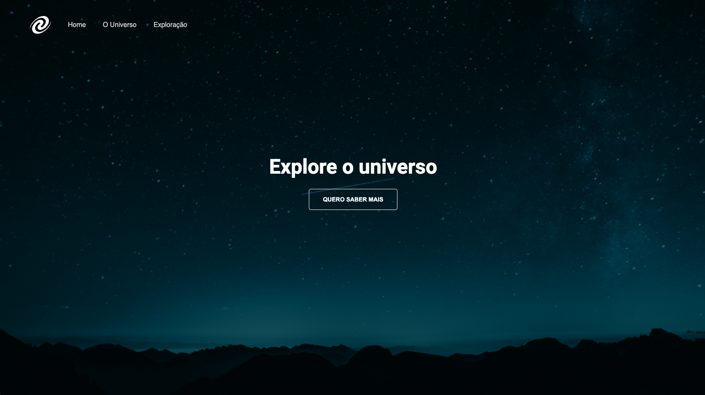
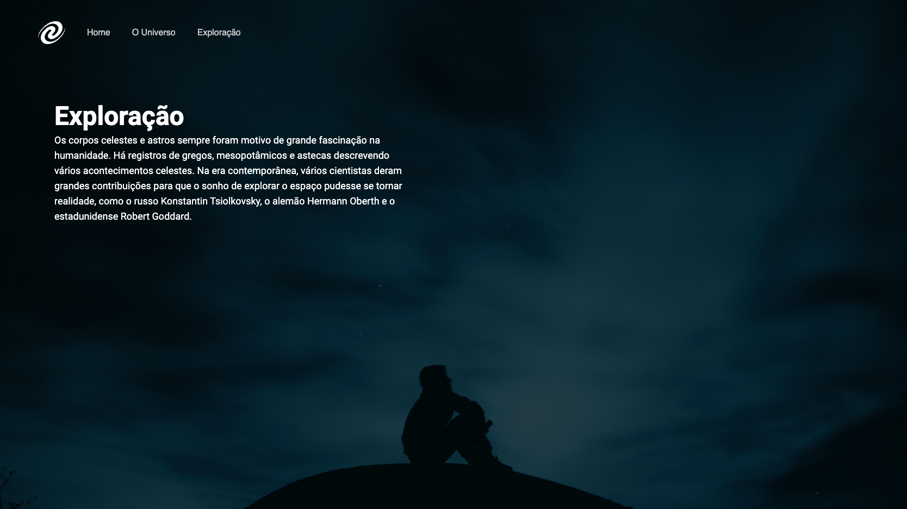
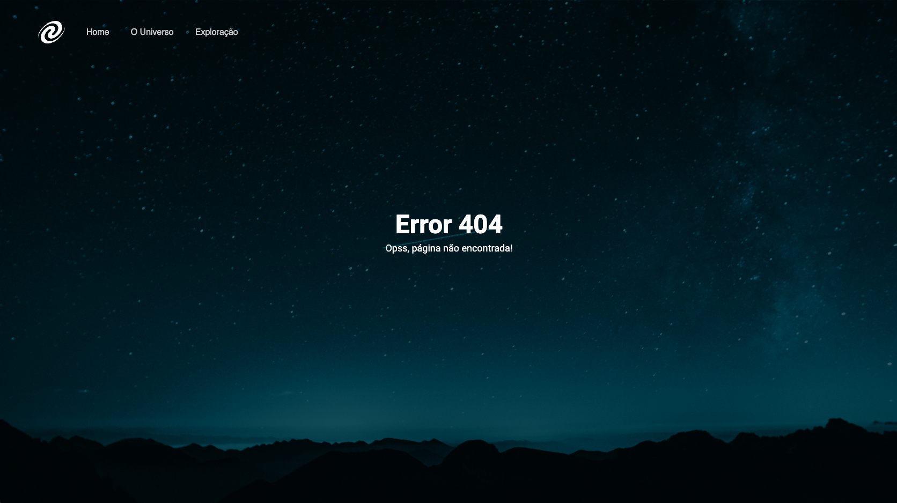

<h1 align="center"> Projeto - SPA Universe</h1>

Hora de se desafiar e colocar em prática o que foi ensinado no stage 06 do curso Explorer da Rocketseat e mais algumas coisas que foram vistas nos stages anteriores.

  <a href="#-tecnologias">Tecnologias</a>&nbsp;&nbsp;&nbsp;|&nbsp;&nbsp;&nbsp;
  <a href="#-projeto">Projeto</a>&nbsp;&nbsp;&nbsp;|&nbsp;&nbsp;&nbsp;
  <a href="#-layout">Layout</a>&nbsp;&nbsp;&nbsp;|&nbsp;&nbsp;&nbsp;

  

 

## 🚀 Tecnologias

Esse projeto foi desenvolvido com as seguintes tecnologias:

&nbsp;
&nbsp;
&nbsp;

## 💻 Projeto

Neste projeto estudei sobre: Conceitos de SPA, mapeamento de rotas, assíncronismo e promises, orientação a objetos, classes e muito mais. Como estudo, foi criado um projeto de site básico utilizando os temas citados.

## 🔖 Layout do projeto

 
 

 
 

 
 

 
 

Link do Figma:
 
https://efficient-sloth-d85.notion.site/SPA-Universe-5f75e94ba7ce4292a06905eb3417420c

 

## Aprendizado

- Conceitos de SPA;
- Mapeamento de rotas;
- Assíncrono e promises;
- Orientação a objetos;
- Classes e muito mais.

 
 

🚀 by Paulo Henrique A. Stabelino.
